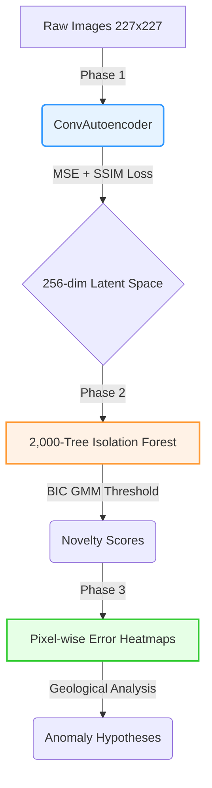

<div align="center">
  
  
  # 🔴 Mars HiRISE: Unsupervised Anomaly Detection
  **NSSC 2026 — National Students Space Challenge | IIT Kharagpur (Data Analytics)**
  
  [](https://www.python.org/)
  [](https://pytorch.org/)
  []()
</div>

---

> [!IMPORTANT]
> **To the Judges:** 
> - **For Code Review:** Please evaluate `notebooks/Mars_HiRISE_Submission.ipynb`. This is the fully executed, end-to-end master notebook containing all 4 phases as required by the rules.
> - **For Technical Documentation:** Please [📥 Download the Final Report PDF (7.3 MB)](https://github.com/devesh3001/MarsSenitel/raw/main/report/Mars_HiRISE_Final_Report.pdf) which contains our high-resolution error heatmaps and complete architectural breakdown.

---

## 🌟 Core Technical Innovations

We built a mathematically rigorous system that strictly adheres to the competition constraints:

1. **Built 100% From Scratch:** No pretrained weights (VGG/ResNet) were used. The **5-Stage Convolutional Autoencoder** was designed and trained entirely from scratch, ensuring true latent compression without data leakage.
2. **Mathematically Honest Thresholding:** We explicitly rejected arbitrary boxplot thresholds. Instead, we used the **Bayesian Information Criterion (BIC)** to dynamically fit a Gaussian Mixture Model (GMM) to the Isolation Forest scores, extracting the anomaly tail mathematically via a 100-source bootstrap.
3. **No Checkerboard Artifacts:** We designed a **resize-convolution decoder** rather than using standard transposed convolutions, completely eliminating checkerboard artifacts in the reconstruction heatmaps.
4. **Transparent Ablations (v1–v8):** We documented 14 total runs. We explicitly retained and documented our negative results (e.g., border artifacts in v4, augmentation collapse in v8) to prove scientific rigor.

---

## 🔬 Key Technical Decisions

### Autoencoder Architecture
- **5-stage ConvAE** from scratch: `1->16->32->64->96->128` channels
- **Resize-convolution decoder** (no transposed convolutions)
- **GroupNorm + SiLU** throughout (stable for small batch sizes)
- **256-dimensional bottleneck** — ablated from 128d (v1 through v3)
- No skip connections: forces true latent compression

### Loss Function (v3 — Canonical)
```
L = 0.9 * MSE + 0.1 * (1 - SSIM)
```
SSIM implemented from scratch with 11x11 Gaussian window (sigma=1.5). No pretrained features anywhere.

### Statistical Threshold (Phase 2.2)
Fit Gaussian Mixture Model (1-4 components, BIC-selected) to calibration scores.
```
T = max_j ( mu_j + 3 * sigma_j )
```
- 100 source-group bootstrap resamples -> 95% CI: **[0.535, 0.550]**
- Final threshold: **T = 0.5425**
- Zero flags is an accepted outcome — threshold is never manually lowered

### Engineering Iterations (v1 -> v8)

| Version | Key Change | Outcome |
|---------|------------|---------|
| v1 | MSE baseline, 128d | Texture blurring identified |
| v2 | + SSIM loss | SSIM 0.661 -> 0.672 |
| **v3** | **128d -> 256d** | **Canonical pipeline — best stable performance** |
| v4 | Contrast normalization | Border artifacts; not promoted |
| v5 | Footprint masking | Too many flags; rejected |
| v6 | Fixed near-black mask | Stripe artifacts; negative result |
| v7 | + Gradient loss | Brightness confound remains; not promoted |
| v8 | Augmentation (flip/rotate) | Zero flags; not promoted |

---

## 📊 Final Results at a Glance

Our canonical pipeline (**v3**) identified **17 anomalous crops** from the 10,422 image dataset, using a statistically sound, data-driven threshold.

| Metric | Result |
|--------|--------|
| **Final Threshold (T)** | **0.5425** *(95% CI: 0.535 to 0.550)* |
| **Flagged Anomalies** | **17 crops** (Top 5 selected for geological hypotheses) |
| **Validation SSIM** | **0.6738** |
| **Validation MSE** | **0.002599** |
| **Forest-Seed Stability** | **> 0.96 Spearman rank** across all repeats |
| **Total Ablation Runs** | **14** (v1 to v8 + 6 robustness checks) |

---

## 🏗️ Architecture & Pipeline



---

## 📁 Repository Map

```text
MarsSenitel/
├── notebooks/                          # Jupyter Notebooks
│   ├── Mars_HiRISE_Submission.ipynb    # ⭐️ THE MAIN SUBMISSION (All phases)
│   ├── 01_Phase1_Deep_Latent_Compression.ipynb
│   ├── 02_Phase2_Isolation_Forest_Novelty.ipynb
│   ├── 03_Phase3_Reconstruction_Interpretability.ipynb
│   └── 04_Phase4_Architecture_Journal.ipynb
├── report/                             # Technical Reports
│   ├── Mars_HiRISE_Final_Report.pdf    # 📥 DOWNLOAD LINK ABOVE
│   └── Mars_HiRISE_Analysis_Report.pdf 
├── src/                                # Core PyTorch ML library
│   ├── model.py                        # ConvAutoencoder architecture
│   ├── evaluate.py                     # IsolationForest + GMM
│   └── threshold.py                    # Statistical threshold logic
├── data/                               # Metadata (Images excluded from git)
├── ENGINEERING_CHANGELOG.md            # Detailed v1-v8 symptom->fix log
└── requirements.txt
```

---

## ⚙️ How to Run Locally

Python 3.11/3.12 is the target environment. Ensure the `data/` folder contains the extracted `DATASETS*.zip` files.

```bash
# 1. Install dependencies
pip install -r requirements.txt

# 2. Run the test suite (19 unit tests)
pytest -q

# 3. Open the main submission notebook
jupyter notebook notebooks/Mars_HiRISE_Submission.ipynb
```

## 📈 Evaluation for Judges

If you have a ground truth CSV file with labels (containing `filename` and `label` columns, where `label=1` indicates an anomaly), you can easily calculate metrics such as ROC-AUC, PR-AUC, and F1 Score using our provided evaluation script.

```bash
# Calculate metrics using the canonical model (v3) output
python scripts/evaluate_labels.py --labels path/to/your_ground_truth.csv
```

<div align="center">
  <i>Developed for the NSSC 2026 Data Analytics Problem Statement.</i>
</div>
